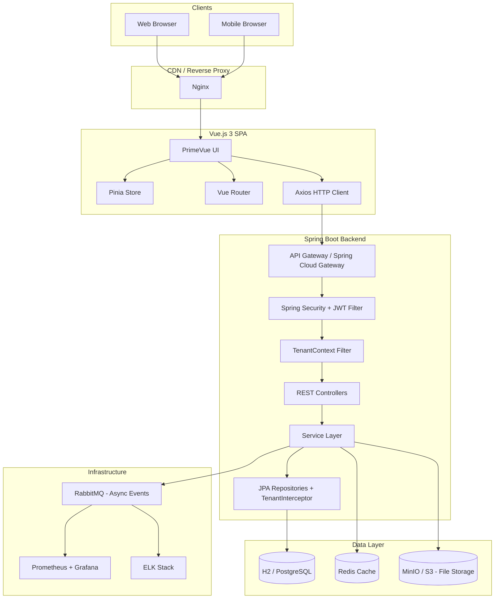
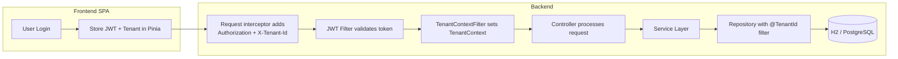
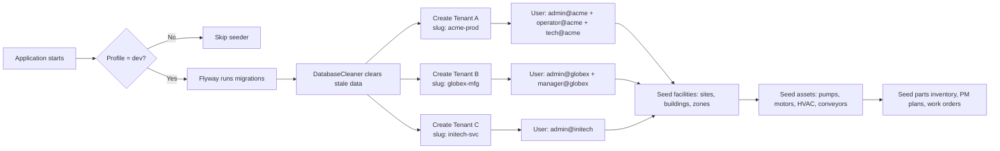
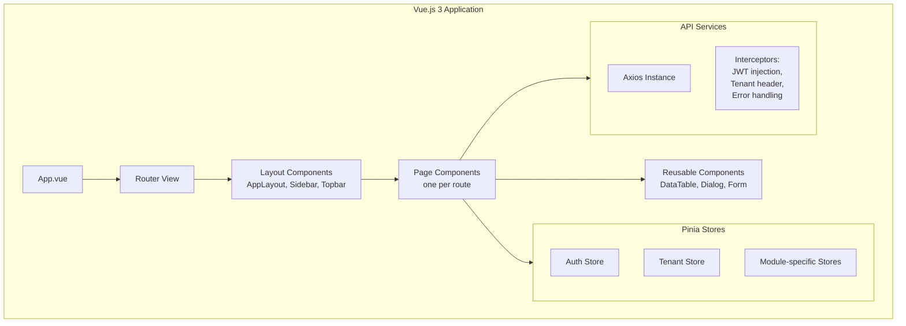
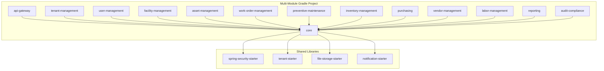
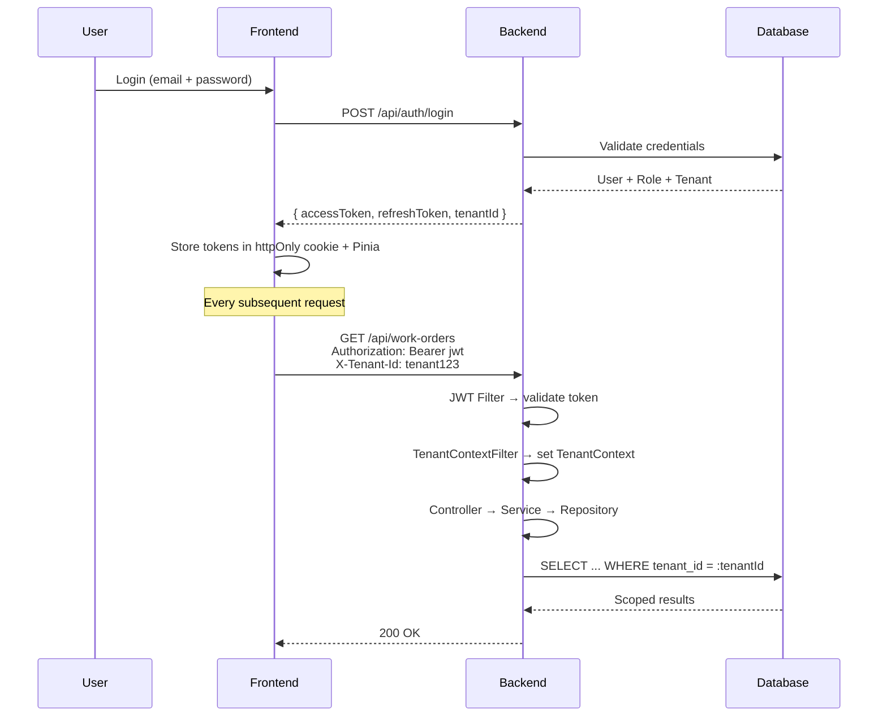

# System Architecture

## Overview

Maint follows a **decoupled frontend/backend** architecture with a **RESTful API** layer. Multi-tenancy is achieved via **row-level isolation** using a shared database where every tenant-scoped table carries a `tenant_id` column.



## Multi-Tenancy Strategy

| Concern | Approach |
|---|---|
| **Data isolation** | Row-level — every tenant-scoped table includes `tenant_id` |
| **Tenant resolution** | `X-Tenant-Id` header injected by Nginx or frontend; resolved by `TenantContextFilter` |
| **Persistence** | Hibernate `@TenantId` annotation + custom `TenantInterceptor` on every write/read |
| **Schema** | Single schema, shared tables |
| **Onboarding** | Tenant record created => DB row inserted => default admin user + roles provisioned |



## Technology Stack

### Frontend

| Layer | Technology |
|---|---|
| Framework | Vue.js 3 (Composition API, `<script setup>`) |
| Language | TypeScript |
| UI Library | PrimeVue 4 |
| State | Pinia |
| Routing | Vue Router 4 |
| HTTP | Axios |
| Build | Vite |
| Testing | Vitest + Vue Test Utils |

### Backend

| Layer | Technology |
|---|---|
| Framework | Spring Boot 3.x |
| Language | Java 21 |
| Security | Spring Security + JWT (jjwt) |
| ORM | Spring Data JPA / Hibernate 6 |
| DB Migrations | Flyway |
| Validation | Jakarta Bean Validation |
| API Docs | SpringDoc OpenAPI (Swagger) |
| Messaging | RabbitMQ / Spring AMQP |
| Testing | JUnit 5 + Testcontainers |
| Build | Gradle (multi-module) |

### Data

| Store | Dev (`application-dev.yml`) | Prod (`application-prod.yml`) | Purpose |
|---|---|---|---|
| H2 (file-based) | `jdbc:h2:file:./data/maint` | — | Dev-only; persisted to `backend/data/maint.mv.db`; auto-seeded once |
| PostgreSQL 16 | — | `jdbc:postgresql://${DB_HOST}:5432/maint` | Prod relational data |
| Redis 7 | — | `redis://${REDIS_HOST}:6379` | Token blacklist, cache, rate-limiting |
| MinIO | Optional (local filesystem fallback) | `https://${MINIO_HOST}:9000` | File attachments (work order images, reports) |

## Profiles & Environments

The application uses Spring Profiles (`dev` / `prod`) to switch between development and production configurations.

| Aspect | Dev (`dev`) | Prod (`prod`) |
|---|---|---|
| **Database** | H2 file-based (`backend/data/maint.mv.db`) | PostgreSQL 16 (Flyway migrations only) |
| **Seeder** | Enabled (once) — creates 3 tenants with rich test data across all modules | Disabled — no initial data |
| **Login** | Quick-login card: lists users grouped by tenant and role; single-click auto-login | Standard email+password form |
| **Redis** | Optional (can fall back to in-memory token store) | Required |
| **CORS** | Permissive (`*`) | Locked to frontend domain |
| **Logging** | `DEBUG` level, console output | `INFO` level, JSON to ELK |

### Seeder (Dev Mode)



The three seeded tenants:

| Tenant | Slug | Users | Profile Data |
|---|---|---|---|---|
| ACME Production | `acme-prod` | admin, operator, tech, supervisor, engineer | 3 sites, 4 buildings, 6 zones, 6 floors, 5 categories, 22 assets, 18 WOs, 8 PM plans, 15 parts, 3 vendors, 4 POs, 3 technicians |
| Globex Manufacturing | `globex-mfg` | admin, manager, tech1, tech2 | 1 site, 2 buildings, 4 zones, 3 floors, 5 categories, 10 assets, 8 WOs, 4 PM plans, 8 parts, 2 vendors, 2 POs, 2 technicians |
| Initech Services | `initech-svc` | admin, tech | 1 site, 1 building, 2 zones, 2 floors, 5 categories, 6 assets, 4 WOs, 2 PM plans, 5 parts, 1 vendor, 1 PO, 1 technician |

### Quick-Login Card (Dev Mode)

In dev mode, the login page is replaced by a **quick-login card** component that displays all seeded users grouped by tenant and role:

```mermaid
flowchart TD
    A[GET /api/dev/users] --> B[Backend returns all users<br/>grouped by tenant + role]
    B --> C[Frontend renders cards]
    C --> D[User clicks a card]
    D --> E[POST /api/dev/login/{userId}]
    E --> F[Backend generates JWT + sets TenantContext]
    F --> G[Redirect to dashboard]

    subgraph Card Layout
        H[Tenant: ACME Production]
        I[Tenant: Globex Manufacturing]
        H --> J[Admin - admin@acme.com]
        H --> K[Operator - operator@acme.com]
        H --> L[Technician - tech@acme.com]
        I --> M[Admin - admin@globex.com]
        I --> N[Manager - manager@globex.com]
    end
```

## Frontend Architecture



## Backend Architecture



## Security Flow



## Cross-Cutting Concerns

| Concern | Implementation |
|---|---|
| Logging | SLF4j + Logback; structured JSON logs shipped to ELK |
| Caching | Spring Cache + Redis; cache keys include tenant_id |
| File Storage | Spring Resource abstraction; MinIO adapter |
| Notifications | RabbitMQ → email/push adapters |
| Audit | Hibernate Envers + custom AuditLog entity |
| Error Handling | `@ControllerAdvice` → unified error response |
| API Versioning | URL path prefix `/api/v1/` |
| Rate Limiting | Bucket4j + Redis |
