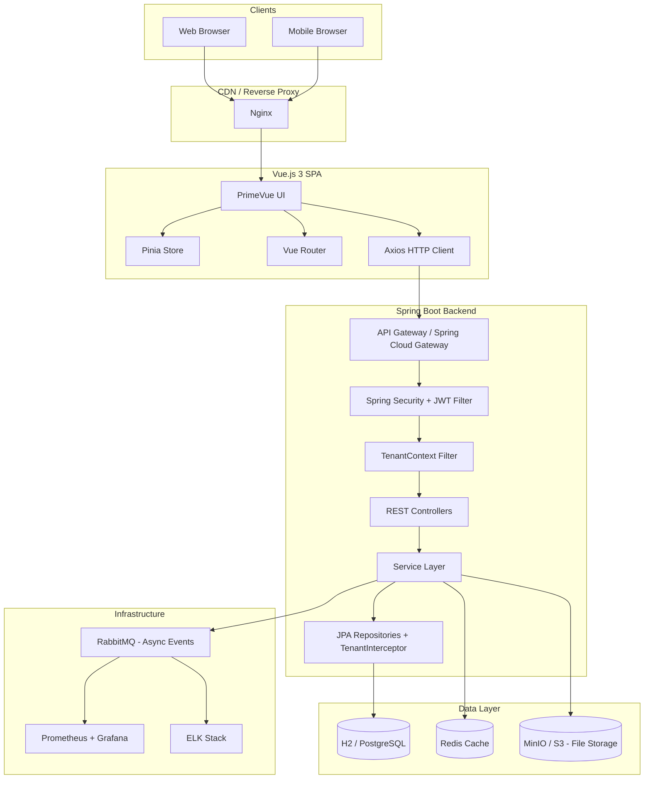
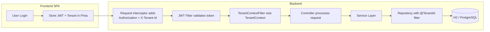
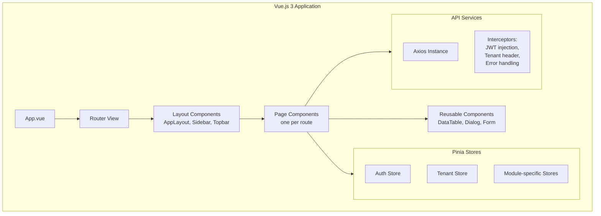
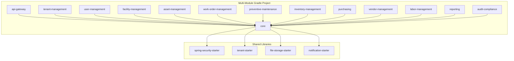
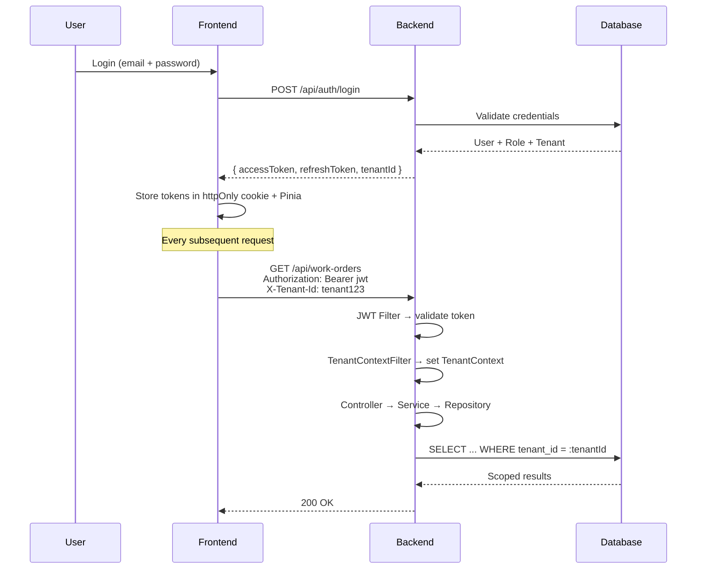

# System Architecture

## Overview

Maint follows a **decoupled frontend/backend** architecture with a **RESTful API** layer. Multi-tenancy is achieved via **row-level isolation** using a shared database where every tenant-scoped table carries a `tenant_id` column.

## Multi-Tenancy Strategy

| Concern | Approach |
|---|---|
| **Data isolation** | Row-level — every tenant-scoped table includes `tenant_id` |
| **Tenant resolution** | `X-Tenant-Id` header injected by Nginx or frontend; resolved by `TenantContextFilter` |
| **Persistence** | Hibernate `@TenantId` annotation + custom `TenantInterceptor` on every write/read |
| **Schema** | Single schema, shared tables |
| **Onboarding** | Tenant record created => DB row inserted => default admin user + roles provisioned |

## Technology Stack

### Frontend

| Layer | Technology |
|---|---|
| Framework | Vue.js 3 (Composition API, `<script setup>`) |
| Language | TypeScript |
| UI Library | PrimeVue 4 |
| State | Pinia |
| Routing | Vue Router 4 |
| HTTP | Axios |
| Build | Vite |
| Testing | Vitest + Vue Test Utils |

### Backend

| Layer | Technology |
|---|---|
| Framework | Spring Boot 3.x |
| Language | Java 21 |
| Security | Spring Security + JWT (jjwt) |
| ORM | Spring Data JPA / Hibernate 6 |
| DB Migrations | Flyway |
| Validation | Jakarta Bean Validation |
| API Docs | SpringDoc OpenAPI (Swagger) |
| Messaging | RabbitMQ / Spring AMQP |
| Testing | JUnit 5 + Testcontainers |
| Build | Gradle (multi-module) |

### Data

| Store | Dev (`application-dev.yml`) | Prod (`application-prod.yml`) | Purpose |
|---|---|---|---|
| H2 (file-based) | `jdbc:h2:file:./data/maint` | — | Dev-only; persisted to `backend/data/maint.mv.db`; auto-seeded once |
| PostgreSQL 16 | — | `jdbc:postgresql://${DB_HOST}:5432/maint` | Prod relational data |
| Redis 7 | — | `redis://${REDIS_HOST}:6379` | Token blacklist, cache, rate-limiting |
| MinIO | Optional (local filesystem fallback) | `https://${MINIO_HOST}:9000` | File attachments (work order images, reports) |

## Running Maint

Running Maint locally — dev/prod profiles, the dev-mode seeder, and the quick-login card — is documented in [Quickstart](/state/quickstart.md).

## Frontend Architecture

## Backend Architecture

## Security Flow

## Cross-Cutting Concerns

| Concern | Implementation |
|---|---|
| Logging | SLF4j + Logback; structured JSON logs shipped to ELK |
| Caching | Spring Cache + Redis; cache keys include tenant_id |
| File Storage | Spring Resource abstraction; MinIO adapter |
| Notifications | RabbitMQ → email/push adapters |
| Audit | Hibernate Envers + custom AuditLog entity |
| Error Handling | `@ControllerAdvice` → unified error response |
| API Versioning | URL path prefix `/api/v1/` |
| Rate Limiting | Bucket4j + Redis |
