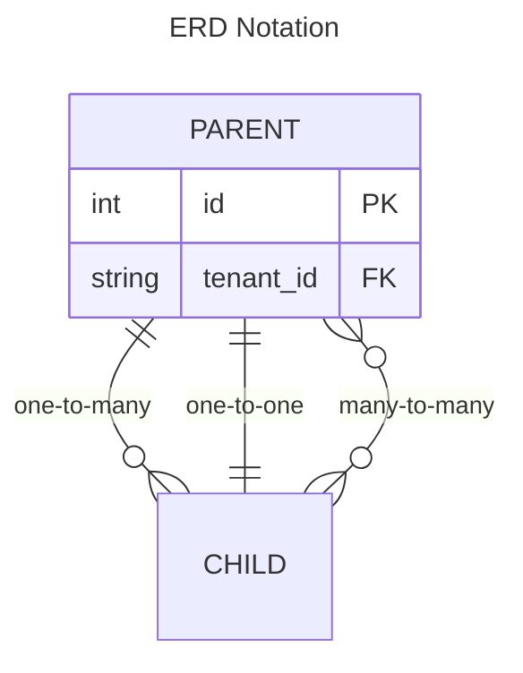

# Module Specifications

Each module specification includes an **Entity Relationship Diagram (ERD)** and a **State Machine** or **Activity Diagram** to clarify domain behavior.

| Module | Status | Key Entities |
|---|---|---|
| [Tenant Management](/charter/specs/modules/tenant-management/index.md) | Stable | `Tenant`, `TenantConfig`, `TenantSubscription` |
| [User & Role Management](/charter/specs/modules/user-role-management/index.md) | Stable | `User`, `Role`, `Permission`, `UserRole` |
| [Facility Management](/charter/specs/modules/facility-management/index.md) | Stable | `Site`, `Building`, `Zone`, `Floor` |
| [Asset Management](/charter/specs/modules/asset-management/index.md) | Stable | `Asset`, `AssetCategory`, `AssetAttribute`, `AssetHistory` |
| [Work Order Management](/charter/specs/modules/work-order-management/index.md) | Stable | `WorkOrder`, `WorkOrderTask`, `WorkOrderStatus` |
| [Preventive Maintenance](/charter/specs/modules/preventive-maintenance/index.md) | Stable | `PMPlan`, `PMSchedule`, `PMTrigger`, `PMGenerationLog` |
| [Inventory Management](/charter/specs/modules/inventory-management/index.md) | Stable | `Part`, `StockLevel`, `InventoryTransaction`, `Warehouse` |
| [Purchasing / Procurement](/charter/specs/modules/purchasing/index.md) | Stable | `PurchaseOrder`, `POItem`, `VendorQuote`, `ApprovalRule` |
| [Vendor Management](/charter/specs/modules/vendor-management/index.md) | Stable | `Vendor`, `VendorContract`, `VendorRating`, `VendorContact` |
| [Labor & Crew Management](/charter/specs/modules/labor-crew-management/index.md) | Stable | `Technician`, `Crew`, `Certification`, `TimeEntry` |
| [Reporting & Analytics](/charter/specs/modules/reporting-analytics/index.md) | Stable | `ReportDefinition`, `Dashboard`, `KPIDefinition`, `ScheduledReport` |
| [Audit & Compliance](/charter/specs/modules/audit-compliance/index.md) | Stable | `AuditLog`, `ComplianceRule`, `AuditReview`, `RetentionPolicy` |

## Legend for Diagrams

All entities include a `tenant_id` column for row-level isolation (omitted from diagrams for readability unless cross-tenant relationships exist).
