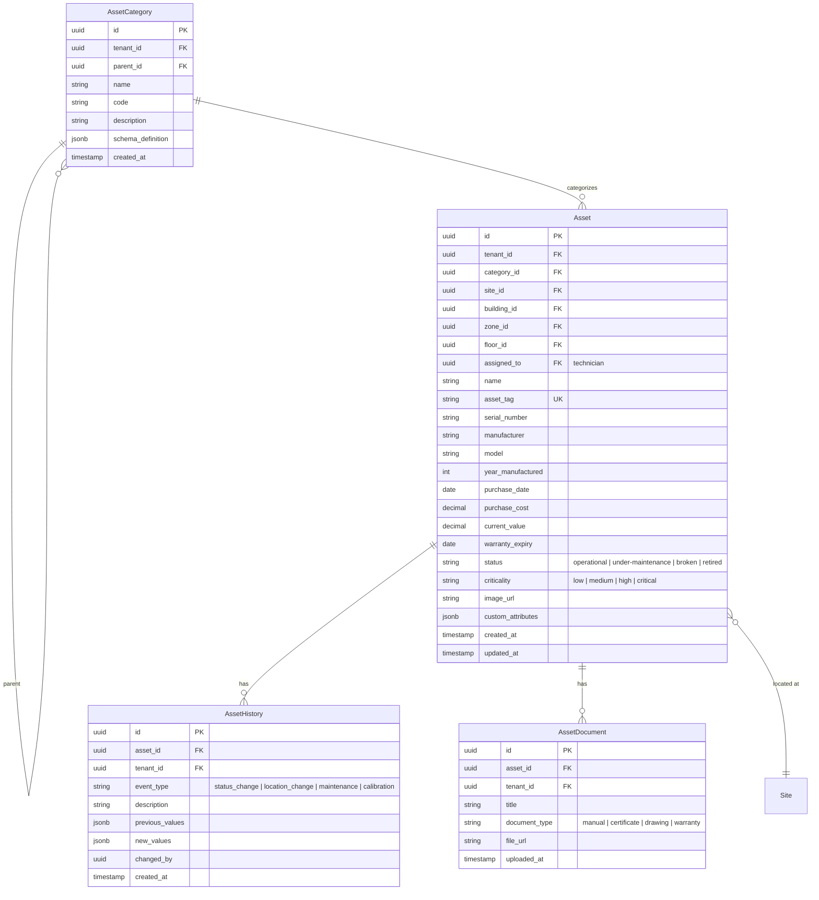
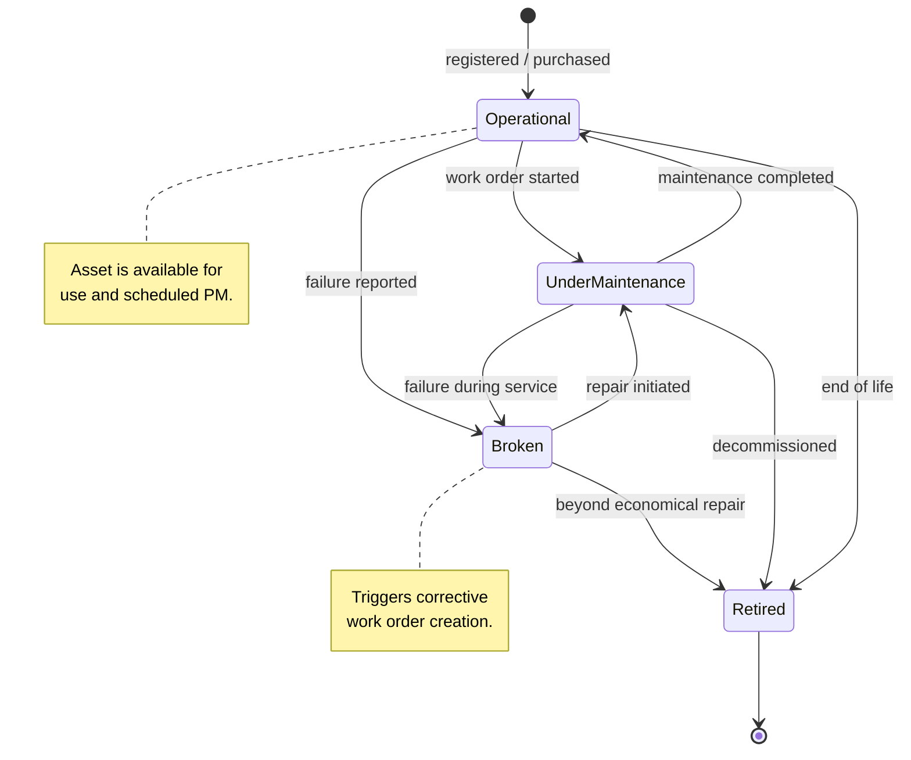

# Asset Management

## Overview

Central register of all equipment and machinery. Tracks location, category, technical attributes, maintenance history, and lifecycle status.

## Entity Relationship Diagram

## State Machine

## API Endpoints

| Method | Path | Description |
|---|---|---|
| GET | `/api/v1/assets` | List assets (filterable) |
| POST | `/api/v1/assets` | Register asset |
| GET | `/api/v1/assets/{id}` | Get asset detail + history |
| PUT | `/api/v1/assets/{id}` | Update asset |
| PATCH | `/api/v1/assets/{id}/status` | Change status |
| GET | `/api/v1/assets/{id}/history` | Get asset history |
| GET | `/api/v1/asset-categories` | List categories (tree) |
| POST | `/api/v1/asset-categories` | Create category |
