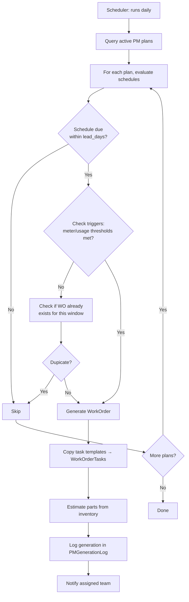

# Preventive Maintenance

## Overview

Defines recurring maintenance plans triggered by **calendar intervals**, **meter readings**, or **usage counts**. Automatically generates work orders when conditions are met.

## Entity Relationship Diagram

```mermaid
erDiagram
    PMPlan {
        uuid id PK
        uuid tenant_id FK
        uuid asset_id FK
        uuid site_id FK
        string name
        string description
        string priority "low | medium | high | critical"
        string status "active | paused | retired"
        bool requires_shutdown
        int estimated_duration_minutes
        timestamp created_at
        timestamp updated_at
    }

    PMSchedule {
        uuid id PK
        uuid pm_plan_id FK
        uuid tenant_id FK
        string trigger_type "time | meter | usage"
        interval_value "e.g. 30"
        interval_unit "days | weeks | months | hours | km | cycles"
        date start_date
        date end_date "nullable"
        int lead_days "days before due to create WO"
        string day_of_week "MON,WED"
        int day_of_month
    }

    PMTrigger {
        uuid id PK
        uuid pm_plan_id FK
        uuid tenant_id FK
        string trigger_type
        decimal threshold_value
        string meter_code
        timestamp last_triggered_at
    }

    PMTaskTemplate {
        uuid id PK
        uuid pm_plan_id FK
        uuid tenant_id FK
        int sequence
        string description
        string required_skill
        decimal estimated_hours
        string safety_notes
    }

    PMGenerationLog {
        uuid id PK
        uuid pm_plan_id FK
        uuid work_order_id FK
        uuid tenant_id FK
        datetime generated_at
        string trigger_reason
        string status "success | skipped"
        string notes
    }

    PMPlan ||--o{ PMSchedule : "scheduled by"
    PMPlan ||--o{ PMTrigger : "triggered by"
    PMPlan ||--o{ PMTaskTemplate : "defines tasks"
    PMPlan ||--o{ PMGenerationLog : "generation history"
    PMPlan }o--|| Asset : "for"
```

## Activity Diagram (PM Generation)



## API Endpoints

| Method | Path | Description |
|---|---|---|
| GET | `/api/v1/pm-plans` | List PM plans |
| POST | `/api/v1/pm-plans` | Create PM plan |
| GET | `/api/v1/pm-plans/{id}` | Get plan with schedules |
| PUT | `/api/v1/pm-plans/{id}` | Update plan |
| POST | `/api/v1/pm-plans/{id}/schedules` | Add schedule |
| POST | `/api/v1/pm-plans/{id}/triggers` | Add trigger |
| POST | `/api/v1/pm-plans/{id}/generate` | Manually trigger generation |
| GET | `/api/v1/pm-plans/{id}/history` | View generation log |
