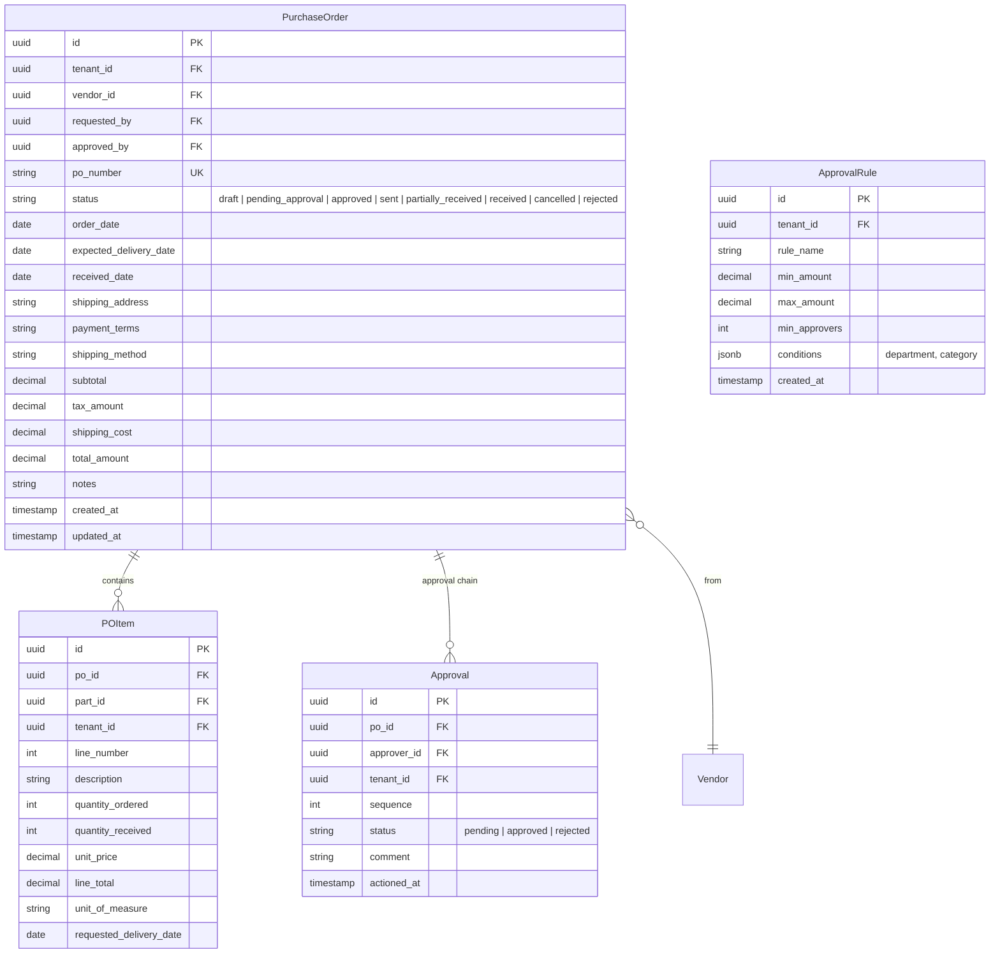
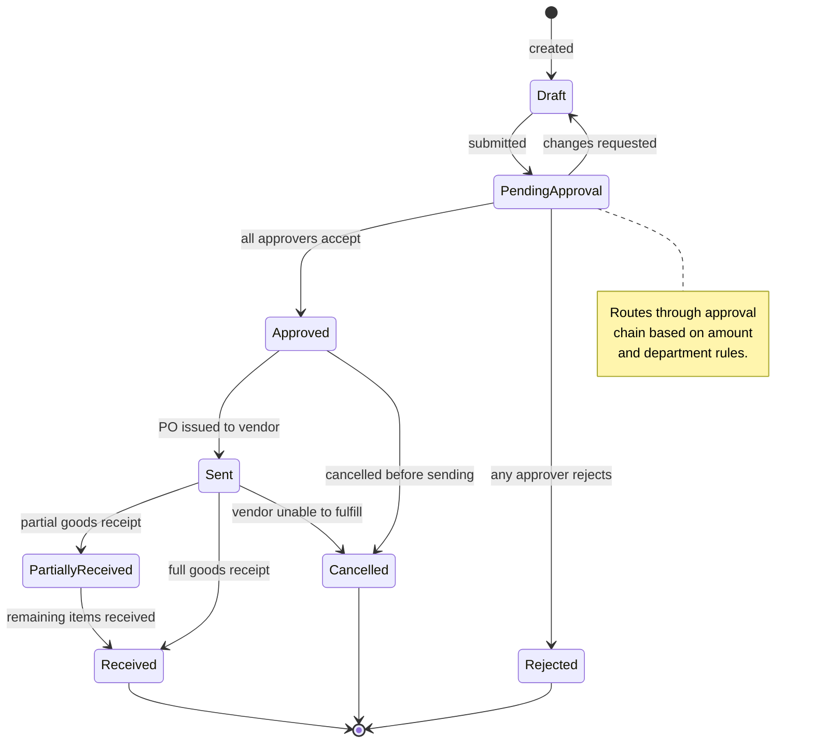
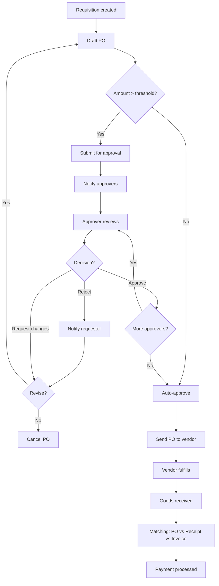

# Purchasing / Procurement

## Overview

Manages the procurement process from requisition to goods receipt. Supports multi-level approval workflows and vendor quote comparison.

## Entity Relationship Diagram

## State Machine

## Activity Diagram (Procurement Flow)

## API Endpoints

| Method | Path | Description |
|---|---|---|
| GET | `/api/v1/purchase-orders` | List POs |
| POST | `/api/v1/purchase-orders` | Create PO |
| GET | `/api/v1/purchase-orders/{id}` | Get PO detail |
| PUT | `/api/v1/purchase-orders/{id}` | Update PO |
| PATCH | `/api/v1/purchase-orders/{id}/status` | Status transition |
| POST | `/api/v1/purchase-orders/{id}/receive` | Record goods receipt |
| GET | `/api/v1/approval-rules` | List approval rules |
| POST | `/api/v1/approval-rules` | Create rule |
