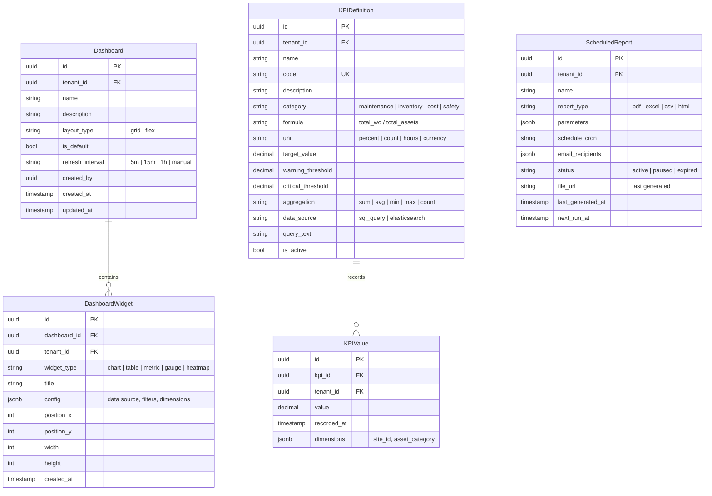
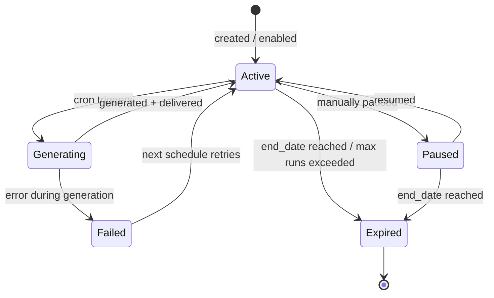

# Reporting & Analytics

## Overview

Provides configurable dashboards, KPI tracking, and scheduled report generation. Supports multiple output formats and automated email distribution.

## Entity Relationship Diagram

## State Machine (Scheduled Report)

## API Endpoints

| Method | Path | Description |
|---|---|---|
| GET | `/api/v1/dashboards` | List dashboards |
| POST | `/api/v1/dashboards` | Create dashboard |
| PUT | `/api/v1/dashboards/{id}/widgets` | Configure widgets |
| GET | `/api/v1/kpis` | List KPI definitions |
| POST | `/api/v1/kpis` | Define KPI |
| GET | `/api/v1/kpis/{id}/values` | Get KPI time series |
| POST | `/api/v1/scheduled-reports` | Schedule report |
| POST | `/api/v1/reports/generate` | Generate one-off report |
| GET | `/api/v1/reports/export` | Export data (CSV/Excel) |
