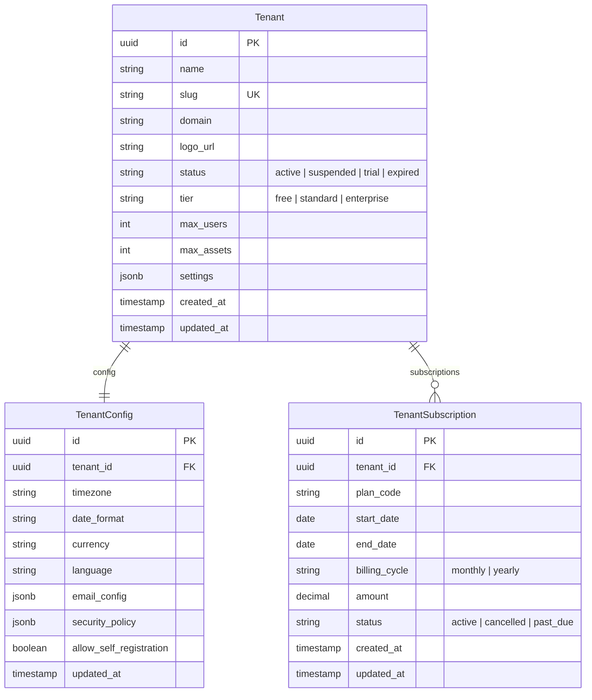
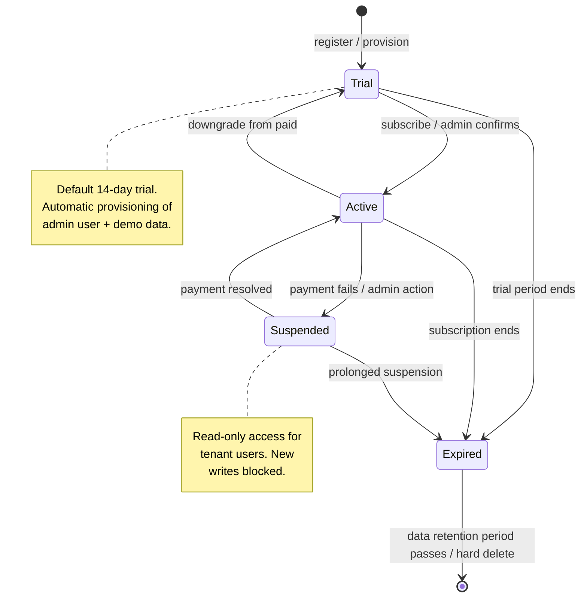

# Tenant Management

## Overview

Manages the lifecycle of organizational tenants. Each tenant represents an independent organization using the system. Tenants are isolated via row-level `tenant_id` on all domain tables.

## Entity Relationship Diagram

## State Machine

## Dev-Mode Seeding

In dev mode (`spring.profiles.active=dev`), the `DatabaseSeeder` runs on startup and creates three tenants with full demo data:

| Tenant | Slug | Domain | Tier | Users |
|---|---|---|---|---|
| ACME Production | `acme-prod` | acme.example.com | enterprise | admin, operator, technician |
| Globex Manufacturing | `globex-mfg` | globex.example.com | standard | admin, manager |
| Initech Services | `initech-svc` | initech.example.com | standard | admin |

Each tenant is provisioned with:
- `TenantConfig` (timezone, currency, language)
- A `TenantSubscription` with `active` status
- A full facility hierarchy (site → building → zone → floor)
- Assets, parts inventory, PM plans, and work orders

The seeder is **disabled** in prod mode — the `@Profile("dev")` annotation on `DatabaseSeeder` ensures no accidental seeding in production.

## API Endpoints

| Method | Path | Description |
|---|---|---|
| POST | `/api/v1/tenants` | Register new tenant |
| GET | `/api/v1/tenants/{id}` | Get tenant details |
| PUT | `/api/v1/tenants/{id}` | Update tenant config |
| PATCH | `/api/v1/tenants/{id}/status` | Change tenant status |
| GET | `/api/v1/tenants/{id}/usage` | Get usage metrics |
