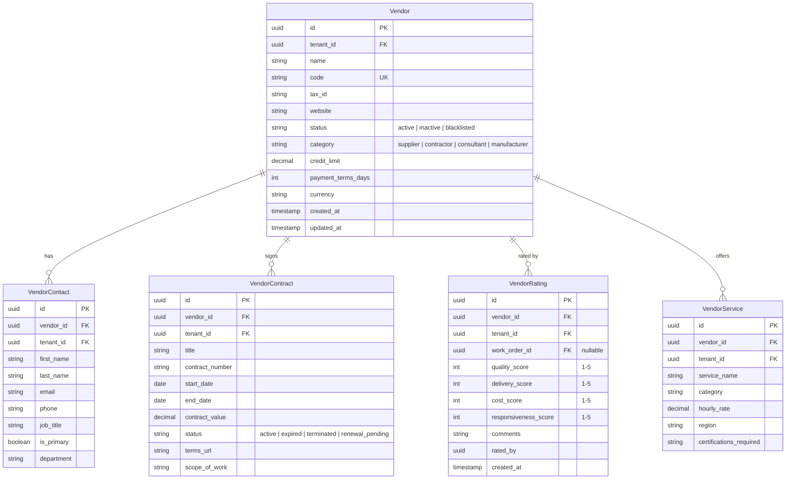
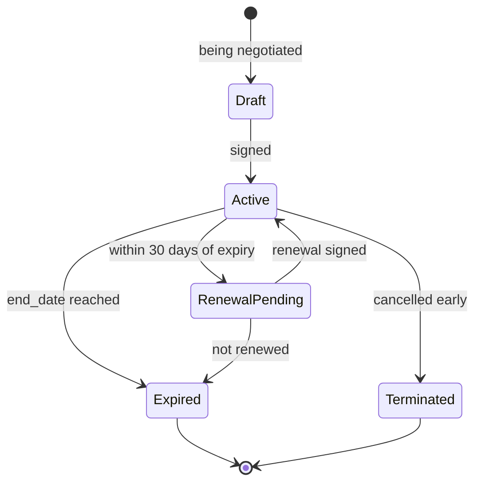

# Vendor Management

## Overview

Manages supplier relationships including company profiles, service contracts, contact persons, and performance scorecards.

## Entity Relationship Diagram

## State Machine (Vendor Contract)

## API Endpoints

| Method | Path | Description |
|---|---|---|
| GET | `/api/v1/vendors` | List vendors |
| POST | `/api/v1/vendors` | Create vendor |
| GET | `/api/v1/vendors/{id}` | Get vendor with contracts |
| PUT | `/api/v1/vendors/{id}` | Update vendor |
| POST | `/api/v1/vendors/{id}/contacts` | Add contact |
| POST | `/api/v1/vendors/{id}/contracts` | Add contract |
| POST | `/api/v1/vendors/{id}/ratings` | Submit rating |
| GET | `/api/v1/vendors/{id}/scorecard` | Average scores |
