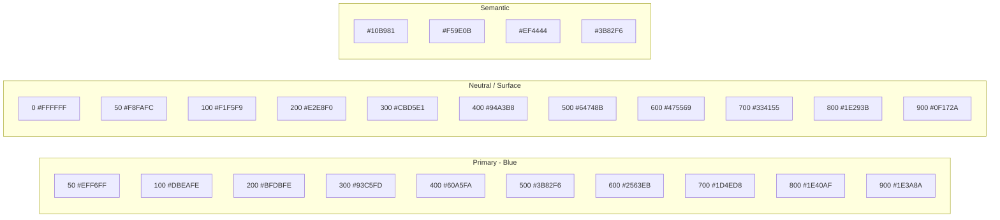

# Design System

## Theme

Maint uses a **custom PrimeVue theme** built with the PrimeVue 4 design token API. The theme is defined in `src/assets/theme/` using CSS custom properties.

### Colour Palette

### Typography

| Token | Value | Usage |
|---|---|---|
| `font-family` | `Inter, system-ui, sans-serif` | All text |
| `font-family-mono` | `JetBrains Mono, monospace` | Code, IDs, serial numbers |
| `font-size-sm` | `0.875rem` | Metadata, footnotes |
| `font-size-base` | `1rem` | Body text |
| `font-size-lg` | `1.125rem` | Sub-headings |
| `font-size-xl` | `1.25rem` | Page titles |
| `font-size-2xl` | `1.5rem` | Section headings |
| `line-height` | `1.5` | Body |
| `font-weight-medium` | `500` | Buttons, labels |
| `font-weight-semibold` | `600` | Table headers |
| `font-weight-bold` | `700` | Strong emphasis |

### Spacing

Based on a 4px grid: `{0, 0.25, 0.5, 1, 1.5, 2, 3, 4, 5, 6, 8, 10}rem` corresponding to `{0, 4, 8, 16, 24, 32, 48, 64, 80, 96, 128, 160}px`.

### Icons

- **Library**: PrimeIcons (PrimeVue built-in)
- **Fallback**: Material Symbols outlined
- **Size**: `1rem` for inline, `1.25rem` for sidebar nav, `1.5rem` for action buttons
