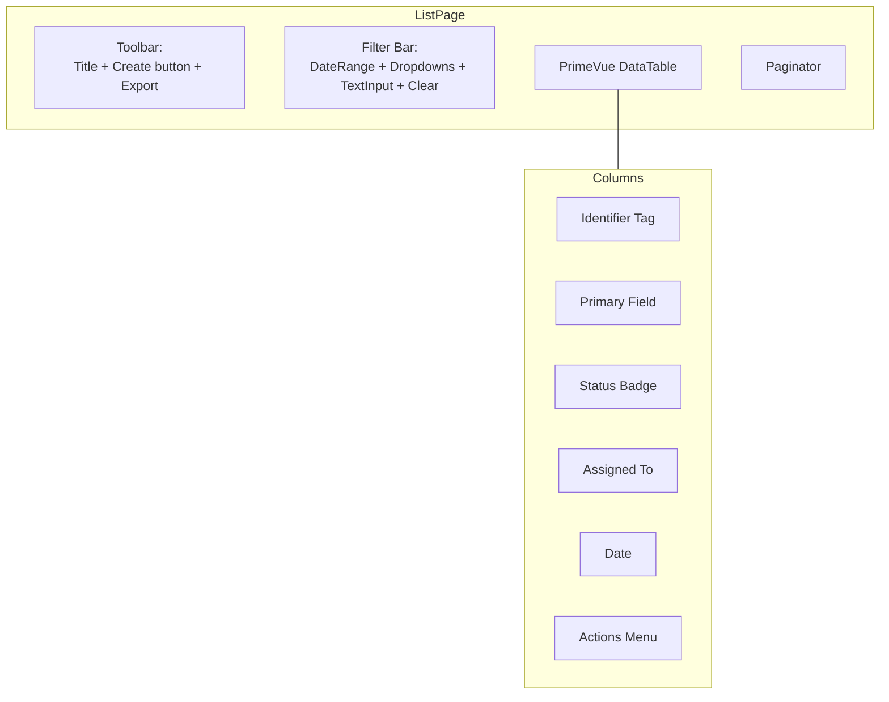
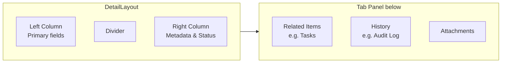
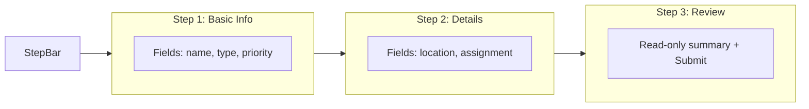
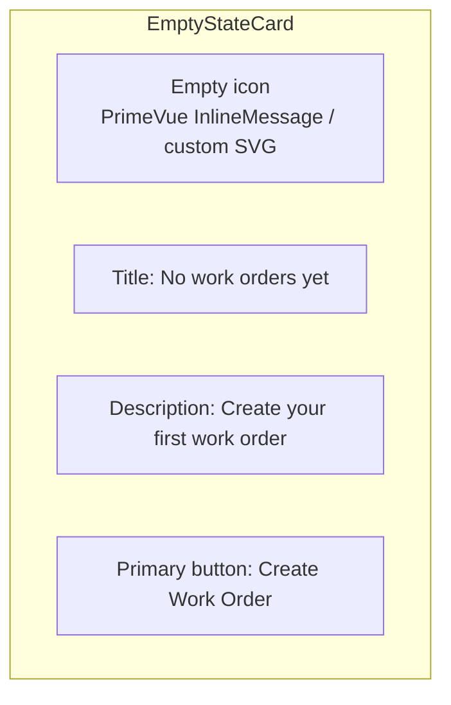

# UI Patterns

## DataTable (List View)

Every module has a primary list page that follows this pattern:

### DataTable Features

- **Sortable** columns (single-column sort)
- **Filterable** — column-level text match where relevant
- **Selectable** rows (single-click selects, checkbox for batch actions)
- **Stateful** — column order, width, and visibility persist per user
- **Lazy loading** — server-side pagination, sorting, filtering
- **Row expansion** — shows related sub-items inline (e.g., tasks under a WO)
- **Inline editing** — editable cells for quick status changes

### Status Badge Convention

| Severity | `Severity` prop | Example |
|---|---|---|
| Active / Success | `success` | Operational, Completed, Approved |
| Warning | `warn` | Pending, On-Hold, Expiring |
| Danger | `danger` | Broken, Overdue, Rejected |
| Info | `info` | In-Progress, Assigned |
| Neutral | `contrast` / `secondary` | Draft, Closed, Inactive |

## Detail Panel

- **Desktop**: side-by-side columns
- **Mobile**: stacked sections

## Dialog (Create / Edit)

- **Size**: small (400px) for simple forms, medium (600px) for standard, large (900px) for complex
- **Position**: centered, closable via overlay click or `X` button
- **Footer**: Cancel + Save / Save & New
- **Validation**: inline messages below each field, disabled Submit until valid

## Wizard (Multi-Step)

Used for: Asset registration, Work Order creation with task breakdown, PO approval.

## Empty State

When a module has no data (or filtered results are empty):

## Loading State

- **Initial load**: DataTable shows `skeleton` rows (4–10)
- **Action loading**: Overlay spinner on the triggering button
- **Page transition**: Topbar loading bar (`NProgress`-style via PrimeVue `ProgressBar`)

## Confirmation Dialog

Used for destructive or impactful actions (delete, cancel, reject):

| Element | Value |
|---|---|
| Header | `Confirm action` |
| Message | `Are you sure you want to delete WO-0042?` |
| Reject button | `Cancel` |
| Accept button | `Delete` (red) |
