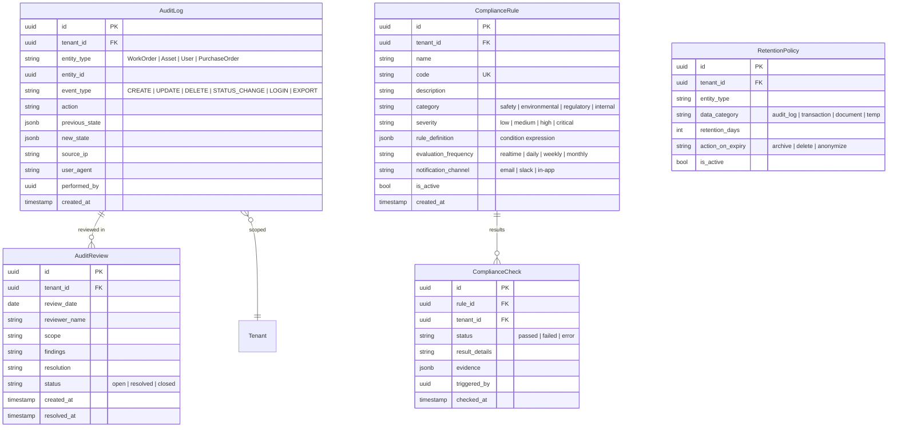
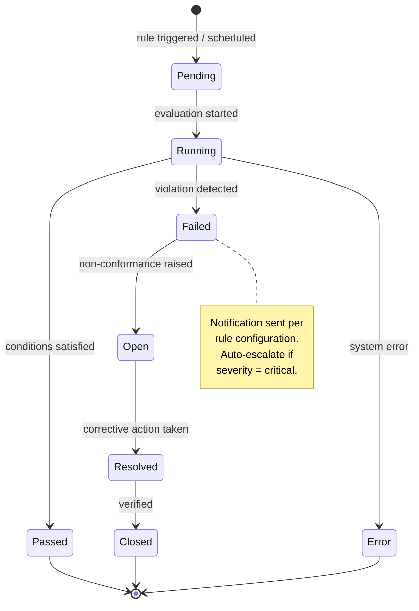
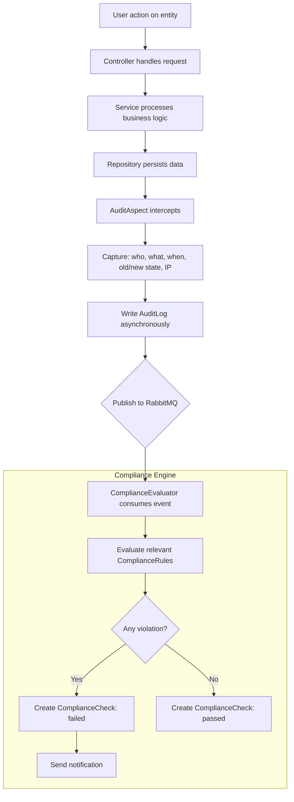

# Audit & Compliance

## Overview

Provides an immutable trail of all domain events, compliance rule definitions with automated checks, and configurable data retention policies.

## Entity Relationship Diagram

## State Machine (Compliance Check)

## Activity Diagram (Audit Trail Flow)

## API Endpoints

| Method | Path | Description |
|---|---|---|
| GET | `/api/v1/audit-logs` | Query audit logs |
| GET | `/api/v1/audit-logs/{entityType}/{entityId}` | Logs for specific entity |
| GET | `/api/v1/compliance-rules` | List rules |
| POST | `/api/v1/compliance-rules` | Create rule |
| POST | `/api/v1/compliance-rules/{id}/evaluate` | Manual evaluation |
| GET | `/api/v1/compliance-checks` | Check results |
| GET | `/api/v1/audit-reviews` | List reviews |
| POST | `/api/v1/audit-reviews` | Create review |
| GET | `/api/v1/retention-policies` | List policies |
| POST | `/api/v1/retention-policies` | Create policy |
