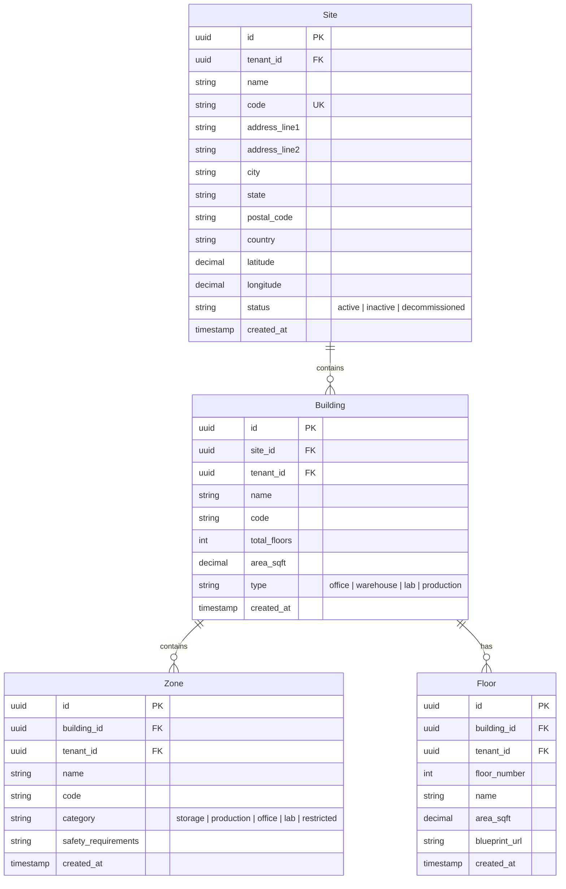
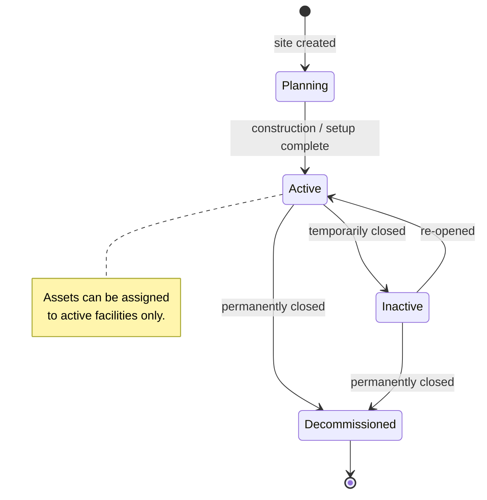

# Facility Management

## Overview

Defines the physical location hierarchy where assets reside and work is performed. Supports a tree structure: **Site → Building → Zone → Floor**.

## Entity Relationship Diagram

## State Machine

## API Endpoints

| Method | Path | Description |
|---|---|---|
| GET | `/api/v1/sites` | List sites |
| POST | `/api/v1/sites` | Create site |
| GET | `/api/v1/sites/{id}/buildings` | List buildings in site |
| POST | `/api/v1/buildings` | Create building |
| GET | `/api/v1/buildings/{id}/zones` | List zones |
| GET | `/api/v1/buildings/{id}/floors` | List floors |
