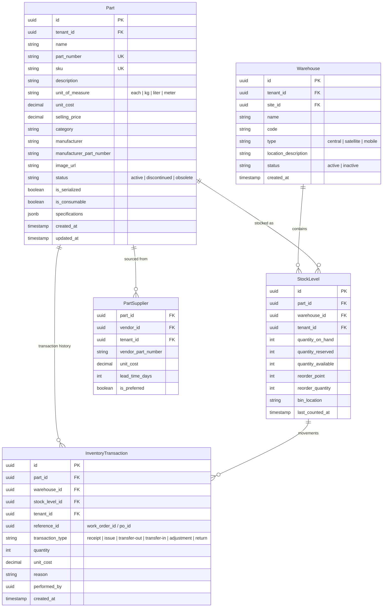
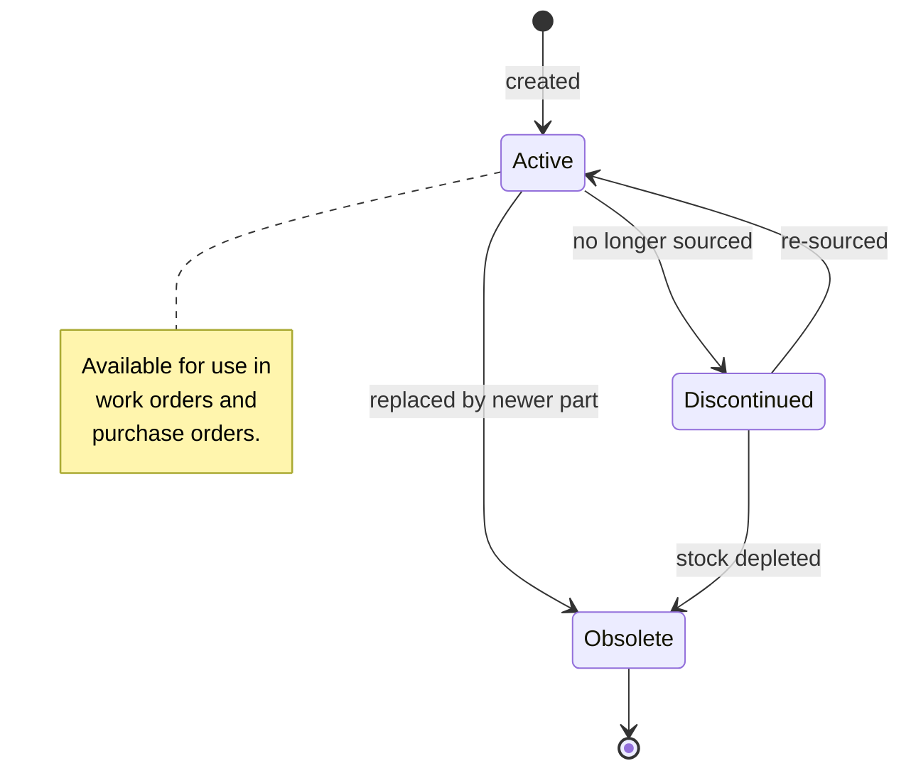
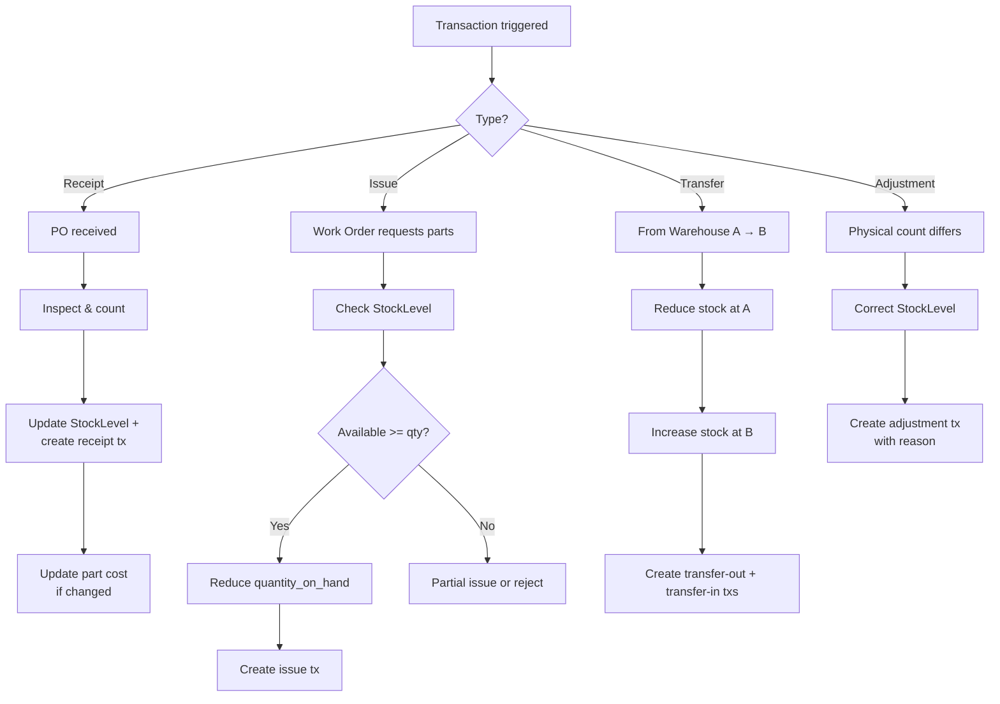

# Inventory Management

## Overview

Manages spare parts inventory across multiple warehouses. Tracks stock levels, transactions (receipt, issue, transfer, adjustment), and reorder thresholds.

## Entity Relationship Diagram

## State Machine (Part)

## Activity Diagram (Stock Movement)

## API Endpoints

| Method | Path | Description |
|---|---|---|
| GET | `/api/v1/parts` | List parts |
| POST | `/api/v1/parts` | Create part |
| GET | `/api/v1/parts/{id}/stock` | Stock across warehouses |
| POST | `/api/v1/inventory/transaction` | Record transaction |
| GET | `/api/v1/inventory/transactions` | Transaction history |
| GET | `/api/v1/inventory/low-stock` | Parts below reorder point |
| POST | `/api/v1/inventory/count` | Submit physical count |
| GET | `/api/v1/warehouses` | List warehouses |
