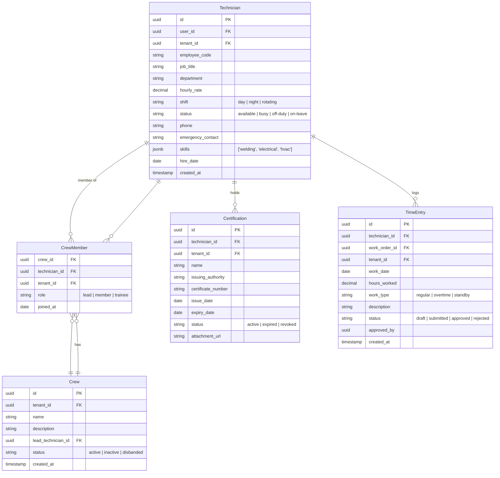
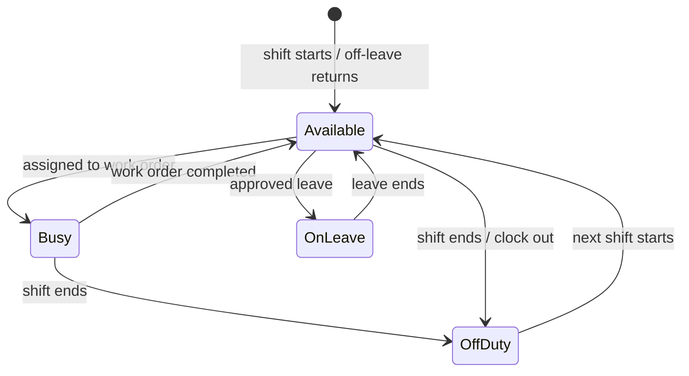
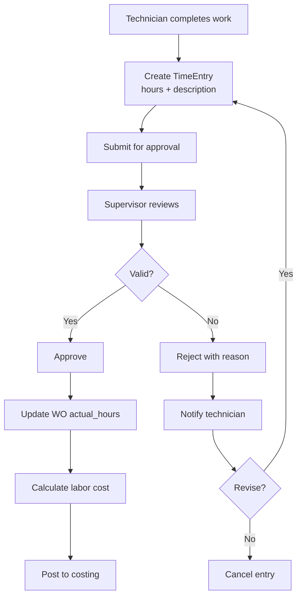

# Labor & Crew Management

## Overview

Manages the workforce — technician profiles, crew groupings, certifications, and time entries against work orders.

## Entity Relationship Diagram

## State Machine (Technician Status)

## Activity Diagram (Time Entry & Approval)

## API Endpoints

| Method | Path | Description |
|---|---|---|
| GET | `/api/v1/technicians` | List technicians |
| POST | `/api/v1/technicians` | Create technician |
| GET | `/api/v1/crews` | List crews |
| POST | `/api/v1/crews` | Create crew |
| POST | `/api/v1/crews/{id}/members` | Add member |
| GET | `/api/v1/technicians/{id}/certifications` | List certs |
| POST | `/api/v1/certifications` | Add certification |
| POST | `/api/v1/time-entries` | Log time |
| PATCH | `/api/v1/time-entries/{id}/approve` | Approve entry |
