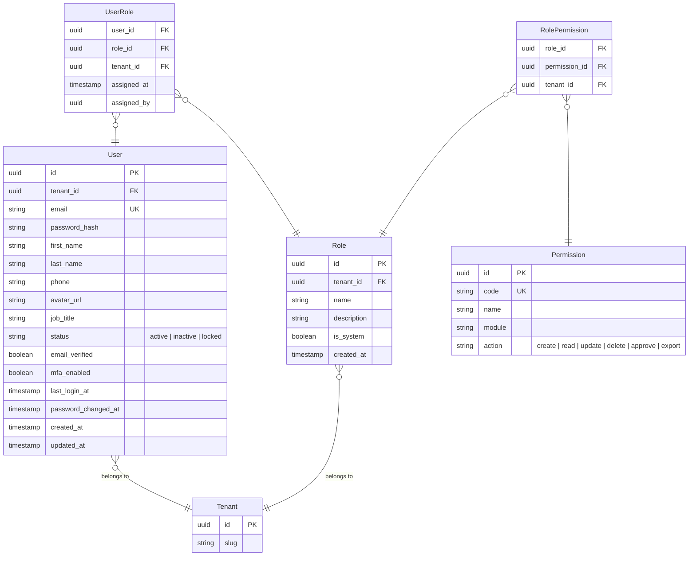
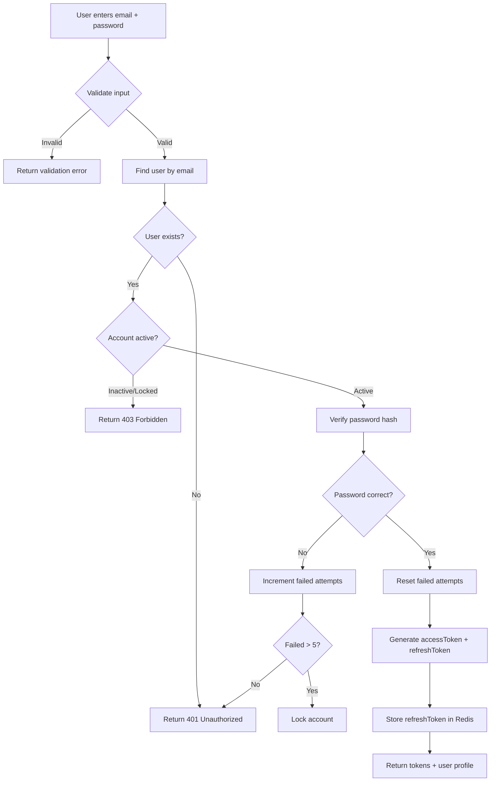
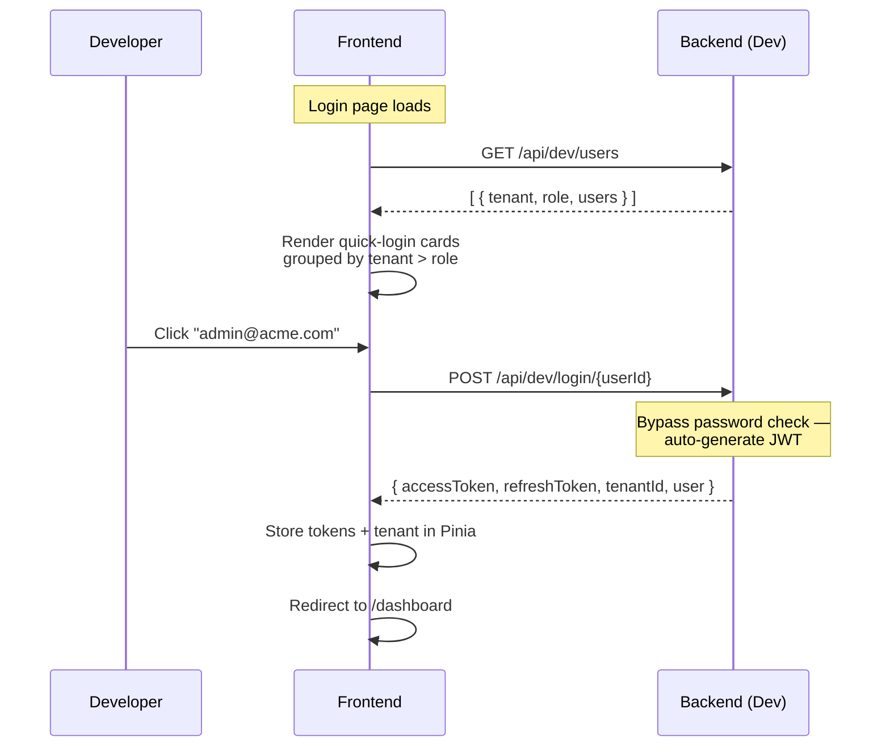

# User & Role Management

## Overview

Manages users within each tenant. Implements **RBAC** (Role-Based Access Control) with fine-grained permissions. Authentication uses **JWT** with access + refresh token flow.

## Entity Relationship Diagram



## Authentication Flow (Activity)



## Dev-Mode Quick Login

In dev mode, the standard login form is replaced by a **quick-login card**. The frontend fetches all seeded users grouped by tenant and role, renders them as clickable cards, and auto-login is performed on click — bypassing password entry.



```mermaid
flowchart TD
    A[Login page mounted] --> B[GET /api/dev/users]
    B --> C[Group by tenant → role → user]
    C --> D[Render PrimeVue CardGrid]
    D --> E[User clicks card]

    subgraph Card UI
        F[Tenant: ACME Production]
        G[Tenant: Globex Manufacturing]
        F --> H[⚙ Admin: admin@acme.com]
        F --> I[👁 Operator: operator@acme.com]
        F --> J[🔧 Tech: tech@acme.com]
        G --> K[⚙ Admin: admin@globex.com]
    end

    E --> L[POST /api/dev/login/{userId}]
    L --> M[JWT issued → redirect to dashboard]
```

### Dev Login Endpoints

| Method | Path | Description |
|---|---|---|
| GET | `/api/dev/users` | List all seeded users grouped by tenant + role |
| POST | `/api/dev/login/{userId}` | Auto-login as user (no password) |

## RBAC Enforcement

```mermaid
flowchart LR
    R[HTTP Request] --> F[JWT Filter]
    F --> C[Controller]
    C --> S[Service Layer]
    S --> G{@PreAuthorize<br/>hasPermission?}
    G -->|Yes| D[Execute]
    G -->|No| E[403 Forbidden]
```

## API Endpoints

| Method | Path | Description |
|---|---|---|
| POST | `/api/v1/auth/login` | Authenticate |
| POST | `/api/v1/auth/refresh` | Refresh token |
| POST | `/api/v1/auth/logout` | Invalidate tokens |
| GET | `/api/v1/users` | List users (tenant-scoped) |
| POST | `/api/v1/users` | Create user |
| PUT | `/api/v1/users/{id}` | Update user |
| GET | `/api/v1/roles` | List roles |
| POST | `/api/v1/roles` | Create role with permissions |
| PUT | `/api/v1/roles/{id}/permissions` | Assign permissions |
