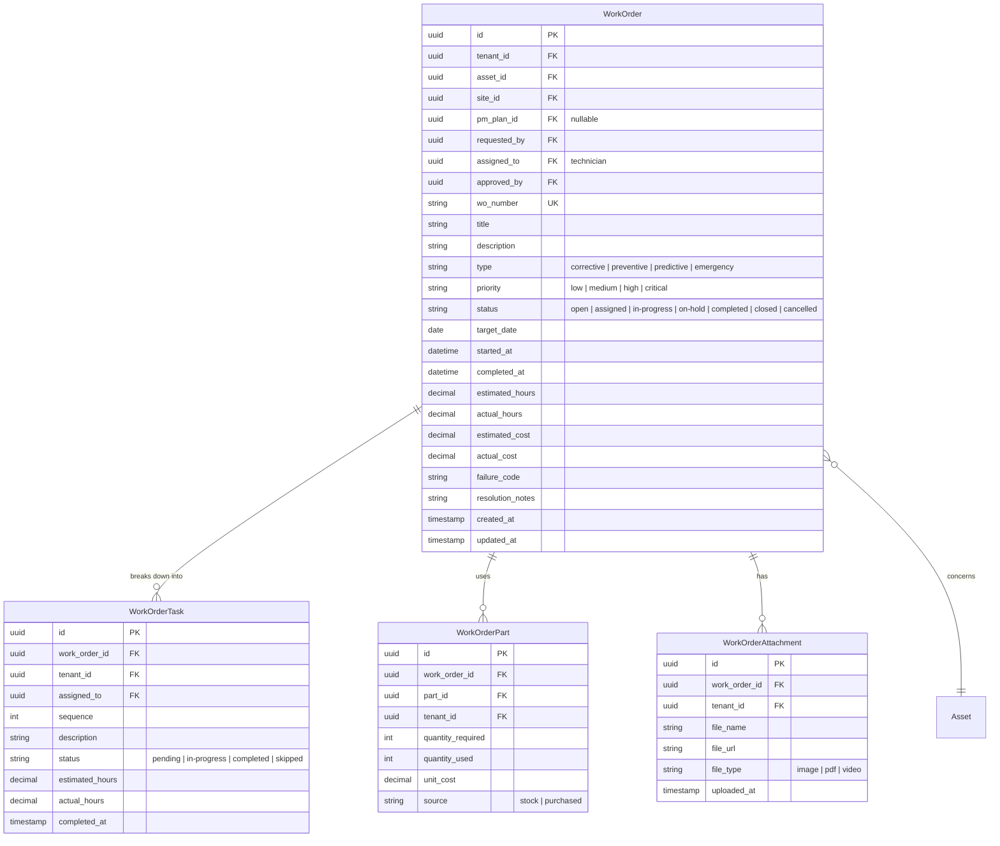
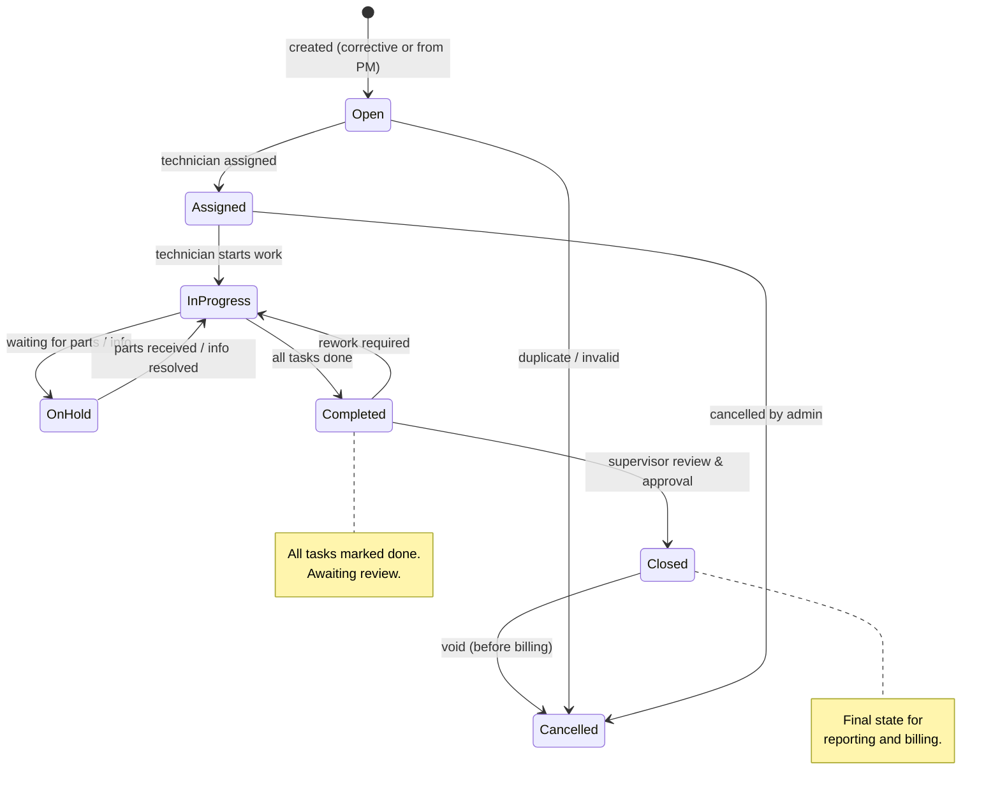
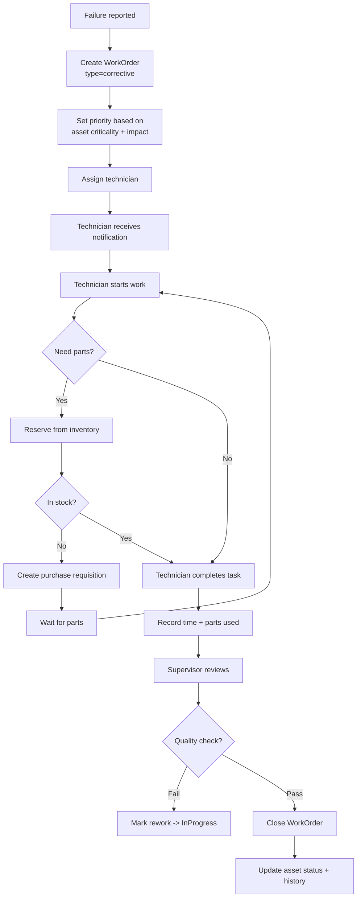

# Work Order Management

## Overview

Core module for managing maintenance tasks. Supports **corrective** (reactive) and **planned** (from PM) work orders. Includes task breakdown, technician assignment, parts reservation, and cost tracking.

## Entity Relationship Diagram

## State Machine

## Activity Diagram (Corrective Flow)

## API Endpoints

| Method | Path | Description |
|---|---|---|
| GET | `/api/v1/work-orders` | List work orders |
| POST | `/api/v1/work-orders` | Create work order |
| GET | `/api/v1/work-orders/{id}` | Get detail |
| PUT | `/api/v1/work-orders/{id}` | Update work order |
| PATCH | `/api/v1/work-orders/{id}/status` | Transition status |
| POST | `/api/v1/work-orders/{id}/assign` | Assign technician |
| POST | `/api/v1/work-orders/{id}/parts` | Add part usage |
| GET | `/api/v1/work-orders/{id}/timeline` | Get status timeline |
