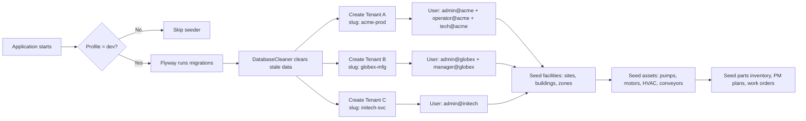

# Quickstart — running Maint locally

How to run Maint in development mode: Spring profiles, the auto-seeded dataset, and the dev quick-login card. This is the current runbook; the stable architecture lives in [System Architecture](/charter/architecture.md).

## Profiles & Environments

The application uses Spring Profiles (`dev` / `prod`) to switch between development and production configurations.

| Aspect | Dev (`dev`) | Prod (`prod`) |
|---|---|---|
| **Database** | H2 file-based (`backend/data/maint.mv.db`) | PostgreSQL 16 (Flyway migrations only) |
| **Seeder** | Enabled (once) — creates 3 tenants with rich test data across all modules | Disabled — no initial data |
| **Login** | Quick-login card: lists users grouped by tenant and role; single-click auto-login | Standard email+password form |
| **Redis** | Optional (can fall back to in-memory token store) | Required |
| **CORS** | Permissive (`*`) | Locked to frontend domain |
| **Logging** | `DEBUG` level, console output | `INFO` level, JSON to ELK |

### Seeder (Dev Mode)



The three seeded tenants:

| Tenant | Slug | Users | Profile Data |
|---|---|---|---|---|
| ACME Production | `acme-prod` | admin, operator, tech, supervisor, engineer | 3 sites, 4 buildings, 6 zones, 6 floors, 5 categories, 22 assets, 18 WOs, 8 PM plans, 15 parts, 3 vendors, 4 POs, 3 technicians |
| Globex Manufacturing | `globex-mfg` | admin, manager, tech1, tech2 | 1 site, 2 buildings, 4 zones, 3 floors, 5 categories, 10 assets, 8 WOs, 4 PM plans, 8 parts, 2 vendors, 2 POs, 2 technicians |
| Initech Services | `initech-svc` | admin, tech | 1 site, 1 building, 2 zones, 2 floors, 5 categories, 6 assets, 4 WOs, 2 PM plans, 5 parts, 1 vendor, 1 PO, 1 technician |

### Quick-Login Card (Dev Mode)

In dev mode, the login page is replaced by a **quick-login card** component that displays all seeded users grouped by tenant and role:

```mermaid
flowchart TD
    A[GET /api/dev/users] --> B[Backend returns all users<br/>grouped by tenant + role]
    B --> C[Frontend renders cards]
    C --> D[User clicks a card]
    D --> E[POST /api/dev/login/{userId}]
    E --> F[Backend generates JWT + sets TenantContext]
    F --> G[Redirect to dashboard]

    subgraph Card Layout
        H[Tenant: ACME Production]
        I[Tenant: Globex Manufacturing]
        H --> J[Admin - admin@acme.com]
        H --> K[Operator - operator@acme.com]
        H --> L[Technician - tech@acme.com]
        I --> M[Admin - admin@globex.com]
        I --> N[Manager - manager@globex.com]
    end
```

