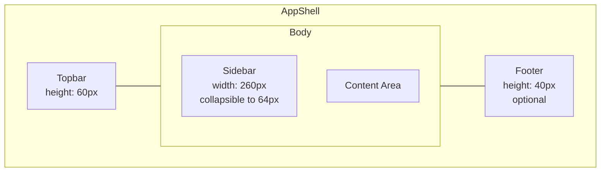

# Layout

## App Shell Structure

### Topbar

| Element | Component |
|---|---|
| App logo / name | `<router-link>` to dashboard |
| Global search | `CommandBar` / `AutoComplete` (searches assets, WOs, parts) |
| Tenant switcher | `SelectButton` (visible only for super-admins) |
| Notification bell | `Badge` + `OverlayPanel` |
| User menu | `Avatar` + `Menu` (profile, settings, logout) |

### Sidebar

- **Collapsible** — 260px expanded, 64px collapsed (icons only)
- **Two sections**: main navigation (top) and utility links (bottom)
- **Active state**: highlighted item with left border accent
- **Sub-menus**: expandable accordion for modules with sub-pages
- **Responsive**: auto-collapses to overlay drawer on screens < 1024px

### Content Area

- **Breadcrumbs** at top: `Dashboard > Work Orders > WO-0042`
- **Page title** with optional action buttons (Create New, Export)
- **Scrollable** content below

## Responsive Breakpoints

| Breakpoint | Behaviour |
|---|---|
| `≥ 1200px` | Full layout — sidebar pinned, content fills remainder |
| `1024px – 1199px` | Sidebar collapses to icon-only rail, hover expands |
| `768px – 1023px` | Sidebar becomes overlay drawer, toggled by hamburger |
| `< 768px` | Stacked layout — topbar full-width, content with minimal padding |
