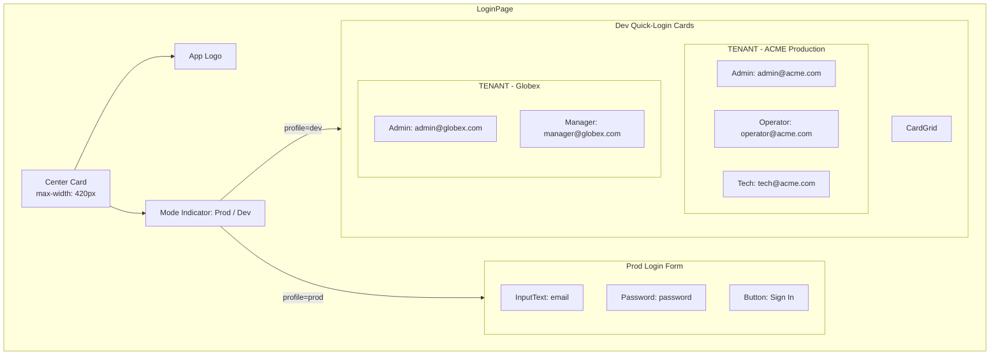
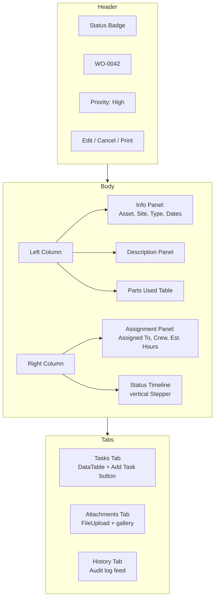
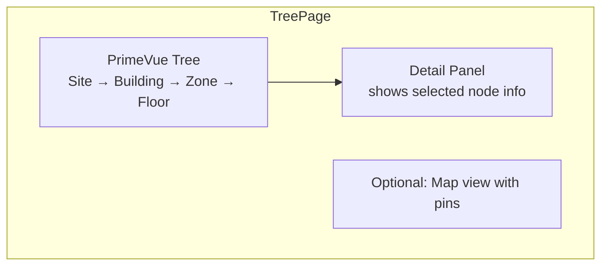
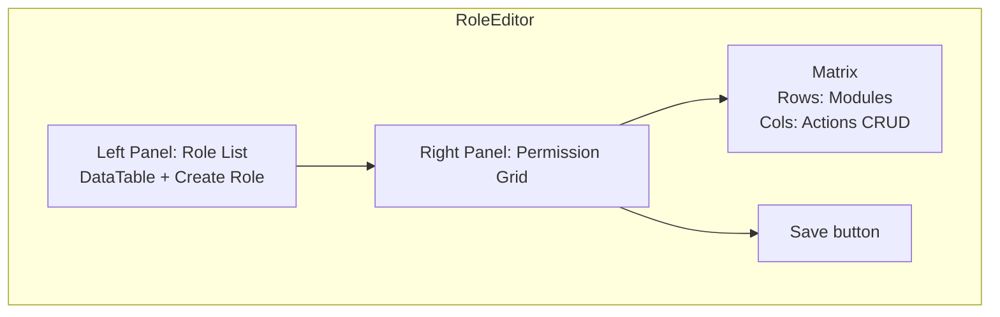
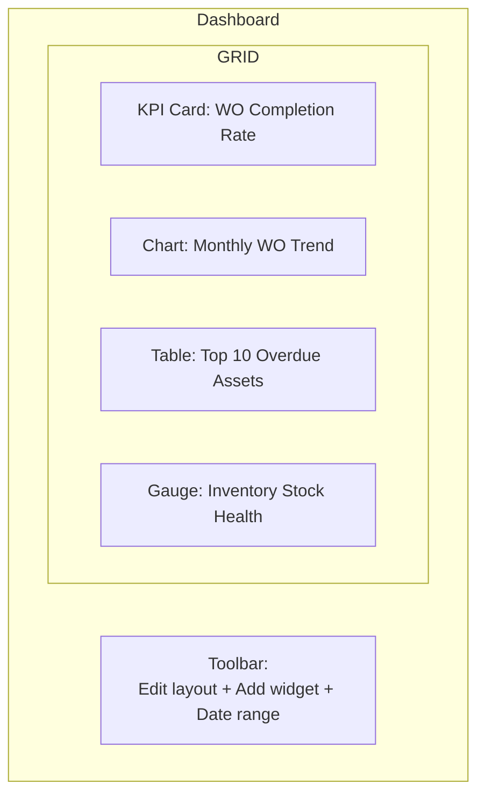
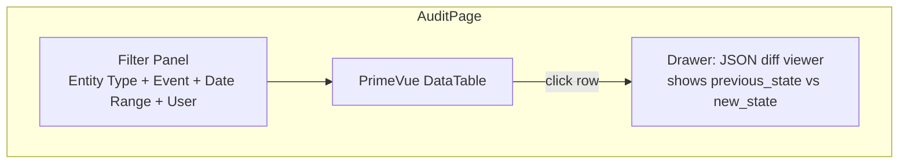

# Module UI Pages

Each module has 2–3 page types: **list** (table), **detail** (view/edit), and optionally a **form** (create wizard). Below is the mapping from module to its page files.

| Module | List Page | Detail Page | Form Page |
|---|---|---|---|
| [Login](#login) | — | — | `LoginPage.vue` |
| [Work Orders](#work-orders) | `WorkOrderListPage` | `WorkOrderDetailPage` | `WorkOrderFormPage` |
| [Assets](#assets) | `AssetListPage` | `AssetDetailPage` | `AssetFormPage` |
| [Preventive Maintenance](#pm) | `PMPlanListPage` | `PMPlanDetailPage` | `PMPlanFormPage` |
| [Inventory](#inventory) | `PartListPage` | `PartDetailPage` | — |
| [Purchasing](#purchasing) | `POListPage` | `PODetailPage` | `POFormPage` |
| [Vendors](#vendors) | `VendorListPage` | `VendorDetailPage` | `VendorFormPage` |
| [Facilities](#facilities) | `SiteListPage` | — | `SiteFormPage` |
| [Labor & Crew](#labor) | `TechnicianListPage` | `TechnicianDetailPage` | — |
| [Users & Roles](#users) | `UserListPage` | — | `RoleEditorPage` |
| [Tenants](#tenants) | `TenantListPage` | `TenantDetailPage` | — |
| [Reports](#reports) | Dashboard builder | — | `ScheduledReportPage` |
| [Audit](#audit) | `AuditLogViewerPage` | — | — |

---

## Login

- **Prod mode**: Standard email + password form, "Forgot password?" link, "Remember me" checkbox
- **Dev mode**: Replaced by quick-login card grid; each card shows avatar, name, email, role badge, tenant tag. Clicking a card triggers auto-login (see [User & Role Management spec](/specs/modules/user-role-management/index.md#dev-mode-quick-login))
- **Mobile**: Card grid collapses to single column

---

## Work Orders

### List Page

| Section | Component |
|---|---|
| Toolbar | `Button` (Create), `SelectButton` (view: All / Mine / Overdue) |
| Filters | `Calendar` (date range), `Dropdown` (status, priority, asset), `InputText` (search) |
| Table | `DataTable` with columns: WO# (tag), Title, Asset, Priority, Status badge, Assigned To, Target Date, Actions |
| Row expand | Shows 3 most recent tasks + a "View all" link |

### Detail Page

---

## Assets

### List Page

- **Hierarchical view toggle**: Flat table or tree table (grouped by category)
- **Quick filters**: Status pills (Operational / Under-Maintenance / Broken / Retired), Criticality chips
- **Columns**: Asset Tag, Name, Category, Location, Status badge, Criticality, Warranty expiry
- **Batch actions**: Selected rows → Update Status, Assign Technician, Print QR labels

### Detail Page

| Panel | Content |
|---|---|
| Header | Asset image (left), Name + Tag + Status (center), Action buttons (right) |
| Info grid | Manufacturer, Model, Serial, Purchase date, Cost, Warranty |
| Location | Site > Building > Zone > Floor breadcrumb |
| Custom attributes | Dynamic key-value table from category schema |
| Tabs | Maintenance History (WO list), Documents, Meter Readings, Audit Log |

### Form Page (Wizard)

| Step | Fields |
|---|---|
| 1. Basic Info | Name, Category (cascading dropdown), Criticality, Status |
| 2. Details | Manufacturer, Model, Serial, Purchase info, Warranty |
| 3. Location | Site → Building → Zone → Floor cascading selects |
| 4. Attributes | Dynamic form rendered from category `schema_definition` |

---

## Preventive Maintenance

### List Page

- **Cards** or **Table** view toggle
- Card shows: PM name, Asset, Schedule summary (e.g., "Every 30 days"), Status badge, Next due date
- **Calendar overlay**: Click to see upcoming WO generations on a mini-calendar

### Detail Page

| Section | Content |
|---|---|
| Header | Name, Status, Priority, Asset link |
| Schedules Panel | Table of schedules (trigger type, interval, lead days). Add/Edit/Delete |
| Tasks Panel | Ordered task templates with drag-to-reorder |
| Last Generation | PMGenerationLog table — date, WO link, result |
| Manual trigger | "Generate WO Now" button with confirmation |

---

## Inventory

### Part List Page

- **Columns**: Part #, SKU, Name, Category, Qty On Hand, Qty Reserved, Reorder Point, Status
- **Colour coding**: Red row when `qty_on_hand <= reorder_point`, amber when within 20%
- **Quick action**: "Order" icon opens a mini-dialog to create a PO for that part

### Part Detail Page

| Section | Content |
|---|---|
| Info | Specifications table from JSON schema, images |
| Stock levels | Per-warehouse DataTable with bin location, qty on hand/reserved/available |
| Transactions | InventoryTransaction DataTable (date, type, qty, reference, user) |
| Suppliers | PartSupplier table with preferred indicator, lead time, cost |

---

## Purchasing

### PO List Page

- **Columns**: PO#, Vendor, Status badge, Total Amount, Order Date, Expected Delivery
- **Status chip colours**: Draft (neutral), Pending Approval (warn), Approved (info), Sent (info), Received (success), Rejected (danger)
- **Approval indicator**: Icon showing approval progress (e.g., 2/3 approved)

### PO Detail Page

| Section | Content |
|---|---|
| Header | PO#, Vendor, Status with action buttons (Submit, Approve, Send, Receive) |
| Items Table | Line items with qty ordered/received, unit price, total |
| Approval Chain | Timeline/stepper showing each approver + status + timestamp |
| Activity | Status change log with timestamps |

---

## Vendors

### List Page

- **Columns**: Code, Name, Category, Status, Contract count, Avg. Rating stars
- **Quick filter**: Category chips, Status dropdown

### Detail Page

| Section | Content |
|---|---|
| Profile | Info grid, tax ID, website, credit limit |
| Contacts | DataTable with primary indicator, phone, email. Add contact dialog. |
| Contracts | DataTable + status badges. Add contract dialog. |
| Scorecard | Average scores (quality, delivery, cost, responsiveness) displayed as star ratings + trend sparkline |
| Rating History | Individual rating entries with comments |

---

## Facilities

### Site Tree View

- **Tree**: Expandable nodes, each with type icon (building, zone, floor)
- **Detail panel**: Selected node's info form (editable inline)
- **Context menu**: Right-click on node → Add child, Edit, Decommission

---

## Labor & Crew

### Technician List Page

- **Columns**: Employee Code, Name, Job Title, Shift, Status badge (coloured dot), Crew membership tags
- **Quick filter**: Shift dropdown, Status chips, Department dropdown

### Technician Detail Page

| Section | Content |
|---|---|
| Profile | Contact info, hourly rate, hire date, emergency contact |
| Skills | Chips/grid of skills (welding, electrical, HVAC) |
| Certifications | DataTable with expiry date (red if expired), upload cert dialog |
| Time Entries | Recent time entries with WO links, approval status |
| Crew Memberships | Crew name, role, joined date |

---

## Users & Roles

### User List Page

- **Columns**: Avatar + Name, Email, Role tags, Status (dot), Last Login
- **Actions**: Edit roles, Reset password, Lock/Unlock

### Role Editor Page

- **Permission matrix**: Checkbox grid where rows = modules (Asset, WO, PM, etc.), columns = actions (Create, Read, Update, Delete, Approve, Export)
- **Select all** per row / per column
- **System roles** (`is_system=true`) are read-only

---

## Tenants

### Tenant List Page

- **Super-admin only** — visible only to users with `role=SUPER_ADMIN`
- **Columns**: Name, Slug, Status badge, Tier, User count, Asset count, Subscription end
- **Actions**: Suspend, Activate, Change tier, View usage

### Tenant Detail Page

| Section | Content |
|---|---|
| Configuration | Timezone, date format, currency, language form |
| Subscription | Plan, billing cycle, start/end dates, amount |
| Usage | User count vs max, asset count vs max, storage used |
| Security policy | Password policy, MFA toggle, session timeout |

---

## Reports

### Dashboard Page

- **Widget types**: KPI card (single metric), Line/Bar/Pie chart, DataTable, Gauge, Heatmap
- **Layout**: Drag-to-reorder, resize from bottom-right handle
- **Persistence**: Widget config saved per dashboard
- **Full-screen mode** for individual widgets

### Scheduled Report Page

- **Schedule form**: Name, Report type (PDF/Excel/CSV/HTML), Data source select, Cron expression builder (visual), Email recipients chip input
- **List**: Table of schedules with last run, next run, status, action buttons (Run Now, Pause, Edit)

---

## Audit

### Audit Log Viewer

- **Columns**: Timestamp, Entity Type, Entity ID, Event, User, IP Address
- **Row click**: Opens side drawer with pretty-printed JSON diff (green for additions, red for removals)
- **Export**: Download filtered results as CSV
- **Retention**: Banner at top showing "Records older than {X} days are auto-archived"

### Compliance Dashboard

| Widget | Content |
|---|---|
| Summary bar | Passed / Failed / Error counts for current period |
| Rule list | DataTable with last check status, click to view details |
| Violation timeline | Bar chart of violations over last 30 days |
| Open reviews | Table of unresolved AuditReviews with severity badges |
