# Navigation

## Route Structure

All module routes follow the pattern `/app/{module}/{sub-page}` and are guarded by a **navigation guard** that validates JWT + tenant context.

| Route path | Component | Auth required |
|---|---|---|
| `/login` | `LoginPage.vue` | No |
| `/app/dashboard` | `DashboardPage.vue` | Yes |
| `/app/work-orders` | `WorkOrderListPage.vue` | Yes |
| `/app/work-orders/new` | `WorkOrderFormPage.vue` | Yes |
| `/app/work-orders/:id` | `WorkOrderDetailPage.vue` | Yes |
| `/app/assets` | `AssetListPage.vue` | Yes |
| `/app/assets/new` | `AssetFormPage.vue` | Yes |
| `/app/assets/:id` | `AssetDetailPage.vue` | Yes |
| `/app/pm-plans` | `PMPlanListPage.vue` | Yes |
| `/app/pm-plans/:id` | `PMPlanDetailPage.vue` | Yes |
| `/app/inventory/parts` | `PartListPage.vue` | Yes |
| `/app/inventory/warehouses` | `WarehouseListPage.vue` | Yes |
| `/app/inventory/transactions` | `TransactionHistoryPage.vue` | Yes |
| `/app/purchasing/orders` | `POListPage.vue` | Yes |
| `/app/purchasing/orders/:id` | `PODetailPage.vue` | Yes |
| `/app/vendors` | `VendorListPage.vue` | Yes |
| `/app/vendors/:id` | `VendorDetailPage.vue` | Yes |
| `/app/facilities/sites` | `SiteListPage.vue` | Yes |
| `/app/facilities/buildings` | `BuildingListPage.vue` | Yes |
| `/app/technicians` | `TechnicianListPage.vue` | Yes |
| `/app/crews` | `CrewListPage.vue` | Yes |
| `/app/time-entries` | `TimeEntryPage.vue` | Yes |
| `/app/users` | `UserListPage.vue` | Yes |
| `/app/roles` | `RoleEditorPage.vue` | Yes |
| `/app/tenants` | `TenantAdminPage.vue` | Yes |
| `/app/reports/dashboards` | `DashboardEditorPage.vue` | Yes |
| `/app/reports/scheduled` | `ScheduledReportPage.vue` | Yes |
| `/app/audit/logs` | `AuditLogViewerPage.vue` | Yes |
| `/app/audit/compliance` | `ComplianceDashboardPage.vue` | Yes |

## Sidebar Menu

```mermaid
graph TB
    subgraph SidebarMenu
        DASH[Dashboard]
        WO[Work Orders]
        PM[Preventive Maintenance]
        ASSETS[Assets]
        INV[Inventory]
        INV_INNER[└ Parts / Warehouses / Transactions]
        PUR[Purchasing]
        PUR_INNER[└ Purchase Orders / Approvals]
        VEND[Vendors]
        FAC[Facilities]
        TECH[Labor & Crew]
        TECH_INNER[└ Technicians / Crews / Time]
        ADMIN[Administration]
        ADMIN_INNER[└ Users / Roles / Tenants]
        REP[Reports]
        REP_INNER[└ Dashboards / Scheduled Reports]
        AUDIT[Audit]
        AUDIT_INNER[└ Audit Log / Compliance]
    end

    DASH --> WO --> PM --> ASSETS --> INV --> INV_INNER
    INV_INNER --> PUR --> PUR_INNER --> VEND --> FAC
    FAC --> TECH --> TECH_INNER --> ADMIN --> ADMIN_INNER
    ADMIN_INNER --> REP --> REP_INNER --> AUDIT --> AUDIT_INNER
```



## Breadcrumbs

Auto-generated from route metadata. Format:

`Home > {Module} > {Sub-page} > {Entity label}`

Example: `Home > Work Orders > WO-0042 > Tasks`

## Lazy Loading

Each module's pages are **lazy-loaded** via Vue Router dynamic imports to keep the initial bundle small:

```typescript
{
  path: '/app/work-orders',
  component: () => import('@/modules/work-order/pages/WorkOrderListPage.vue')
}
```
